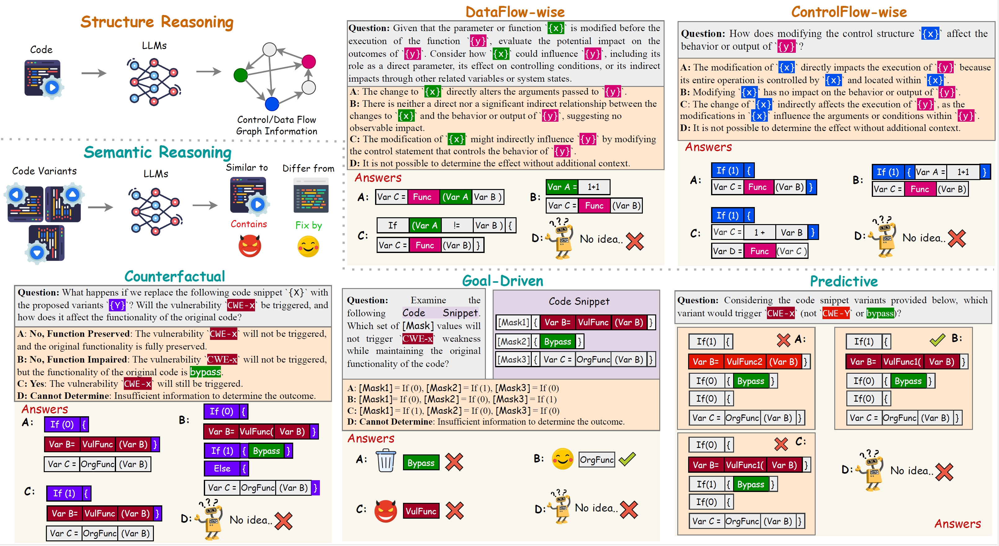
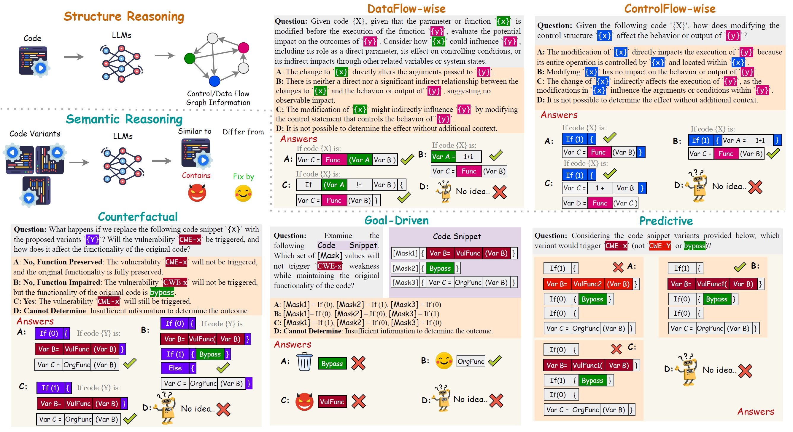

# SV‑TrustEval‑C 🚨🔒

[](LICENSE) [](https://ieeexplore.ieee.org/document/) [](https://www.python.org) [](https://anonymous.4open.science/r/TrustEval-1D7B)



## 🔍 Overview
SV‑TrustEval‑C is the first reasoning‑based benchmark designed to rigorously evaluate Large Language Models (LLMs) on both **structure** (control/data flow) and **semantic** reasoning for vulnerability analysis in C source code. Unlike existing benchmarks that focus on pattern recognition, SV‑TrustEval‑C measures logical consistency, adaptability to code transformations, and real‑world security reasoning across six core tasks.

Our benchmark reveals that current LLMs predominantly rely on superficial pattern matching, exposing critical gaps in their ability to understand complex code relationships and ensure trustworthy vulnerability analysis.


## 📖 Table of Contents
- [Key Features](#key-features)
- [Installation](#installation)
- [Quick Start](#quick-start)
- [Benchmark Tasks](#benchmark-tasks)
- [Evaluation Metrics](#evaluation-metrics)
- [Dataset](#dataset)
- [Results Structure](#results-structure)
- [Supported Models](#supported-models)
- [Contributing](#contributing)
- [Citation](#citation)
- [License](#license)

---

## ⭐ Key Features
- 🎯 **Dual Reasoning Dimensions:** Structure (ControlFlow/DataFlow) & Semantic (Counterfactual/Goal‑Driven/Predictive)
- 📊 **Comprehensive Metrics:** Accuracy, Conceptual Distance Sensitivity, Reasoning Consistency
- 🔄 **Plug‑and‑Play Framework:** Seamless integration with Hugging Face models
- 🌐 **Open Dataset & Scripts:** Fully reproducible; Reliable label accuracy

---

## ⚙️ Installation
```bash
git clone https://github.com/Jackline97/SV-TrustEval-C.git
cd SV-TrustEval-C
pip install -r requirements.txt
```

---

## 🚀 Quick Start
### Single-Model Evaluation
```bash
python Eval_Script/Test_Script_HF.py \
  --model_name "llama-3.1-8b-instruct" \
  --benchmark_loc "./SV-TrustEval-C-Official-1.0" \
  --result_loc "./results" \
  --temperature 0.0 \
  --inference_mode "zero-shot"
```

### Batch Evaluation
```bash
python Eval_Script/Run_Test_script_HF.py
```

### Performance Analysis
```bash
python Eval_Script/Run_Eval_script.py \
  --root_folder "./results/LLM_result_zero-shot_0.0" \
  --save_path "./results/eval_score.json"
```

---

## 📋 Benchmark Tasks
| Dimension | Task            | Description |
|-----------|-----------------|-------------|
| Structure | ControlFlow     | Analyze program control-flow impacts |
| Structure | DataFlow        | Trace data dependencies and influence |
| Semantic  | Counterfactual  | Predict vulnerability under code perturbations |
| Semantic  | GoalDriven      | Safely modify code to meet functional goals |
| Semantic  | Predictive      | Classify variants by vulnerability impact |

---

## 📈 Evaluation Metrics
- **Accuracy**: Task-level correctness
- **Conceptual Distance Sensitivity**: Ability to handle increasing structural complexity
- **Reasoning Consistency**: Logical coherence across related queries

---

## 💾 Dataset
Download the benchmark (v1.0):
👉 [SV-TrustEval-C Official Dataset](./SV-TrustEval-C-Offical-1.0.zip)

Structure: Organized by CWE category with paired safe/unsafe/impaired variants and question templates.

---

## 📊 Results Structure
```bash
results/
└── LLM_result_[mode]_[temp]/
    └── [model_name]/
        ├── ControlFlow/
        ├── DataFlow/
        ├── Counterfactual/
        ├── GoalDriven/
        └── Predictive/
```



---

## 🤖 Supported Models
- Meta Llama-3.1-8B-Instruct
- Gemma-7B-IT
- Mistral-7B-Instruct
- CodeQwen1.5-7B
- CodeGemma-7B
- CodeLlama-13B/7B-Instruct
- And more via Hugging Face

---

## 🤝 Contributing
Contributions are welcome! Please read [CONTRIBUTING.md](CONTRIBUTING.md) and file issues or pull requests.

---

## 📚 Citation
```
Accepted by IEEE Symposium on Security and Privacy (S&P) 2025! Paper will come soon
```
---


## 📄 License
Released under the **MIT License**. See [LICENSE](LICENSE) for details.

