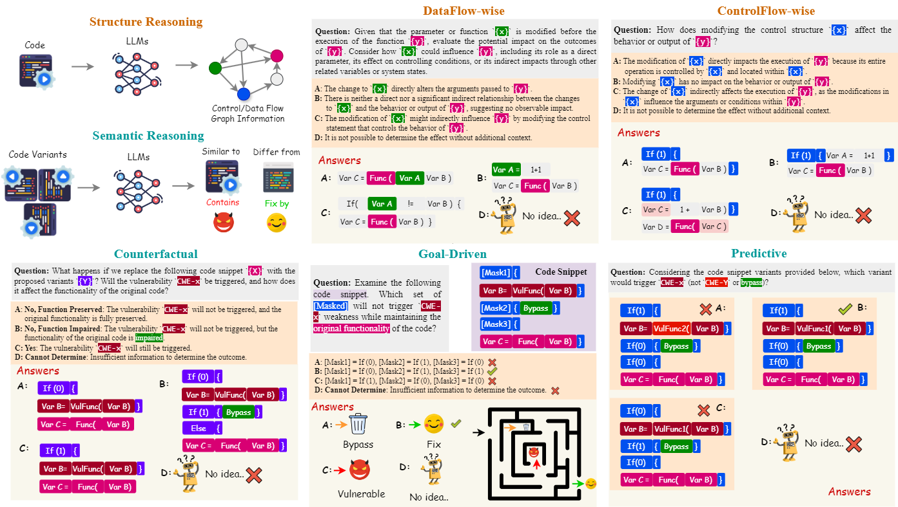

# SV-TrustEval: Evaluating Semantic and Structural Trustworthiness of Source Code Vulnerability Analysis

Welcome to the official repository for the SV-TrustEval benchmark, introduced in our latest research to critically assess the semantic and structural analysis capabilities of Large Language Models (LLMs) on source code vulnerabilities. This benchmark is specifically designed to address significant gaps in evaluating the reliability of LLMs' vulnerability analysis, which is crucial for their trustworthy application in real-world cybersecurity tasks.

## About SV-TrustEval

SV-TrustEval provides a comprehensive framework to evaluate how well LLMs can understand and reason about code, particularly focusing on identifying and predicting vulnerabilities within the C programming language. The benchmark comprises two main components:
- **Structure Reasoning:** Assesses the ability of LLMs to accurately discern the relationships between code elements and predict how changes can propagate errors or vulnerabilities.
- **Semantic Reasoning:** Tests the LLMs' ability to maintain analysis accuracy across various coding scenarios, including counterfactuals, goal-driven modifications, and predictive assessments.

## Key Contributions

- **Novel Benchmarking Approach:** Introduces new methods to measure the analytical depth of LLMs concerning code structure and semantics.
- **Insightful Evaluations:** Offers in-depth insights into the current limitations and capabilities of state-of-the-art LLMs in handling complex code analysis tasks.
- **Open Resource:** Provides a valuable dataset and evaluation metrics for the community to engage with and improve upon the robustness of code vulnerability analysis tools.

## Dataset Access

The benchmark dataset, detailed evaluation protocols, and additional resources are available at: generated_questions.zip

## How to Use This Repository

This repository contains the necessary scripts and tools to evaluate the performance of language models in code vulnerability analysis using the SV-TrustEval benchmark. Below are detailed instructions on how to set up your environment, run the evaluations for API-based Models, and interpret the results.

### Prerequisites

1. **Python Installation**: Ensure you have Python 3.7 or higher installed on your machine.
2. **Dependency Installation**: Install all required Python libraries by running:
   ```bash
   pip install tqdm json re logging argparse tokenize openai
   ```

### Running Evaluations
1. **Unzip Data Files**: Unzip generated_questions.zip


2. **Configure API Keys**: Ensure you have set up your OpenAI API key in your environment. This is necessary for the script to interact with OpenAI's models. You can set it up by:
   ```bash
   export OPENAI_API_KEY='your_api_key_here'
   ```

3. **Edit Model Configuration**: Modify the `models` dictionary in the `run_script.py` script if you want to test additional models or change model settings. For example:
   ```python
   models = {
       "GPT35": "gpt-3.5-turbo",
       "GPT4": "gpt-4-turbo-2024-04-09"
   }
   ```
  
4. **Run the Evaluation Script**: Execute the main evaluation script using:
   ```bash
   python run_script.py
   ```

### Understanding the Output

- The scripts will automatically log the output of the evaluation, including accuracy metrics and other relevant details, to the console and to output files within the designated directories (`LLM_result/`).
- Each model's results are stored in separate subdirectories named after the model and the type of reasoning test (e.g., `LLM_result/GPT4/Structure_Reasoning/`).

## License

This project is open-source and available under the [MIT License](LICENSE). The MIT License is a permissive license that allows you to use, copy, modify, merge, publish, distribute, sublicense, and/or sell copies of the software, provided that appropriate credit is given to the original author and contributors.

For more details, see the [LICENSE](LICENSE) file included with this repository.
