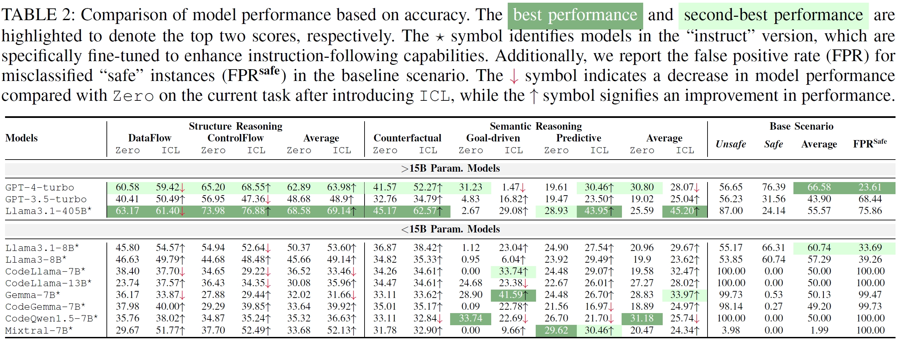

# SV-TrustEval-C
*Evaluating Structure and Semantic Reasoning in Large Language Models for Source Code Vulnerability Analysis*

SV-TrustEval-C is a benchmark designed to critically assess Large Language Models’ (LLMs) ability to analyze and reason about vulnerabilities in C source code. This repository contains the benchmark framework, dataset, evaluation scripts, and detailed documentation to advance research in secure code analysis.

---

## Table of Contents

- [About SV-TrustEval-C](#about-sv-trusteval-c)
- [Key Contributions](#key-contributions)
- [Publication](#publication)
- [Dataset Access](#dataset-access)
- [Repository Structure](#repository-structure)
- [Getting Started](#getting-started)
- [Usage](#usage)
  - [Running Tests with a Single Model](#running-tests-with-a-single-model)
  - [Running Tests with Multiple Models](#running-tests-with-multiple-models)
  - [Evaluating Model Performance](#evaluating-model-performance)
- [Benchmark Tasks](#benchmark-tasks)
- [Evaluation Metrics](#evaluation-metrics)
- [Inference Modes](#inference-modes)
- [Supported Models](#supported-models)
- [Results](#results)
- [License](#license)

---

## About SV-TrustEval-C


SV-TrustEval-C evaluates LLMs on two core dimensions:

- **Structure Reasoning:** Understanding program control flow and data flow relationships.
- **Semantic Reasoning:** Assessing vulnerability detection through baseline, counterfactual, goal-driven, and predictive tasks.

---

## Key Contributions

- Introduces novel metrics for measuring structural and semantic analysis depth.
- Provides comprehensive insights into current LLM strengths and limitations for vulnerability analysis.
- Offers an open benchmark dataset and evaluation framework for community-driven improvements.

---

## Publication

"SV-TrustEval-C: Evaluating Structure and Semantic Reasoning in Large Language Models for Source Code Vulnerability Analysis," accepted at the **46th IEEE Symposium on Security and Privacy (S&P 2025)**.

---

## Dataset Access

Download the benchmark dataset and resources:

[Download Benchmark Dataset](./SV-TrustEval-C-Offical-1.0.zip)

---

## Repository Structure

```plaintext
.
└── Eval_Script/
    ├── fewshot_examples/
    ├── Test_Script_HF.py
    ├── Run_Test_script_HF.py
    ├── Eval_script.py
    └── Run_Eval_script.py
```

---

## Getting Started

### Prerequisites

- Python 3.6+
- PyTorch
- Transformers (Hugging Face)
- CUDA-compatible GPU (recommended)

### Installation

```bash
git clone https://github.com/your_username/SV-TrustEval-C.git
cd SV-TrustEval-C
pip install torch transformers tqdm
```

---

## Usage

### Running Tests with a Single Model

```bash
python Test_Script_HF.py --model_name "Llama31-8b" \
                         --model_loc "meta-llama/Meta-Llama-3.1-8B-Instruct" \
                         --benchmark_loc "SV-TrustEval-C-Offical-1.0" \
                         --result_loc "SV-TrustEval-C-Offical-1.0_results" \
                         --temperature 0.0 \
                         --inference_mode "zero-shot"
```

### Running Tests with Multiple Models

```bash
python Run_Test_script_HF.py
```

### Evaluating Model Performance

```bash
python Run_Eval_script.py
```
or
```bash
python Eval_script.py --root_folder "SV-TrustEval-C-Offical-1.0_results/LLM_result_zero-shot_0.0" \
                      --save_path "SV-TrustEval-C-Offical-1.0_results/eval_score"
```

---

## Benchmark Tasks

### Structure Reasoning
- **ControlFlow**: Program control flow understanding
- **DataFlow**: Data flow and variable relationship comprehension

### Semantic Reasoning
- **Base_questions**: Baseline vulnerability detection
- **Counterfactual**: Counterfactual reasoning
- **GoalDriven**: Goal-oriented reasoning
- **Predictive**: Predictive vulnerability assessment

---

## Evaluation Metrics

- Accuracy across tasks
- Performance variation by conceptual distance
- Consistency of reasoning

---

## Inference Modes

- **Zero-shot**: No examples provided
- **Few-shot**: In-context learning with examples

---

## Supported Models

Compatible Hugging Face models include Llama-3.1-8B-Instruct, Gemma-7B-IT, Mistral-7B-Instruct, CodeQwen1.5-7B, CodeGemma-7B, CodeLlama-13B/7B-Instruct, and more.

---

## Results

Results are saved under:

```plaintext
result_loc/
└── LLM_result_[inference_mode]_[temperature]/
    └── [model_name]/
        ├── ControlFlow/
        ├── DataFlow/
        ├── Base_questions/
        ├── Counterfactual/
        ├── GoalDriven/
        └── Predictive/
```



---

## License

This project is released under the MIT License. See [LICENSE](LICENSE) for details.
